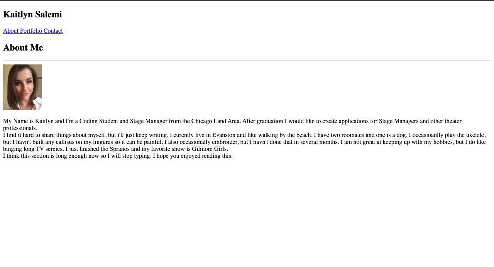
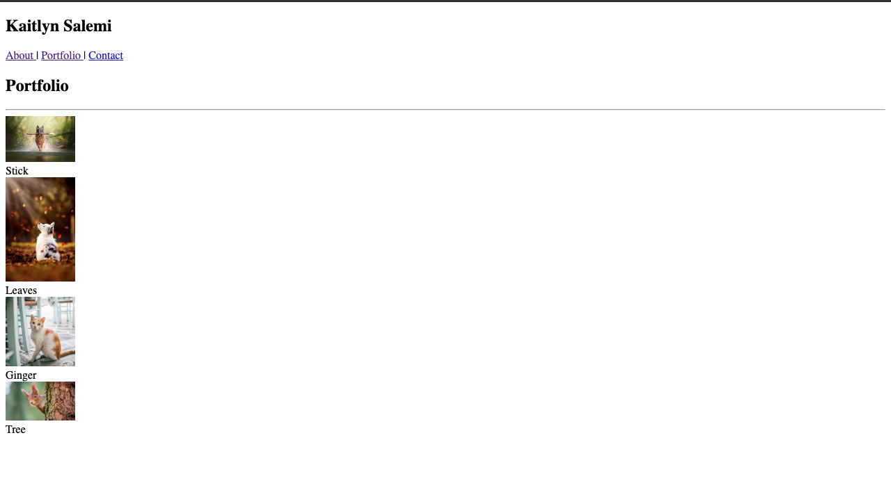
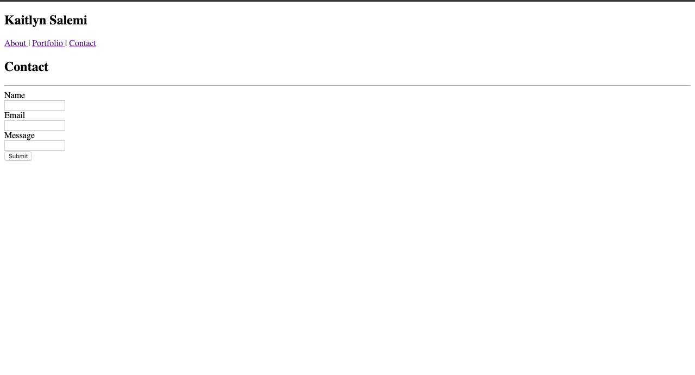

# Portfolio

I inserted all the data into the html file.

made nav bar with a header "Kaitlyn Salemi" and three clickables that will take you to the other html pages

made a section with another header "About Me", horizontal line, image, and paragraph.

also made a footer. Is not visable in the picture below

copy and pasted the code from the first html file

kept the information in the nav and the footer

I replaced the paragraph with the images and the boxes 

copy and pasted the code form the portfolio html file 

kept the navbar code and footer

changed the heading and made a form for name email and message 

