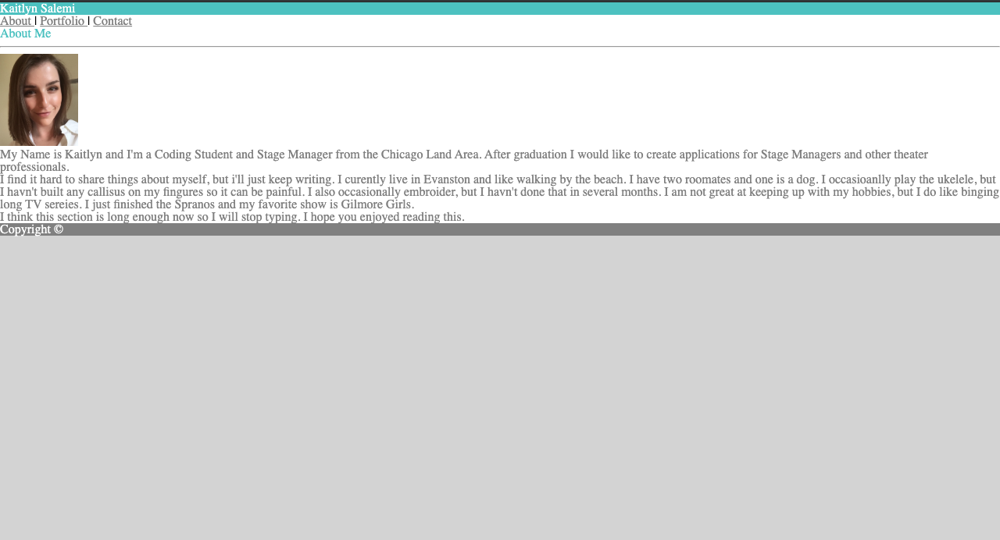
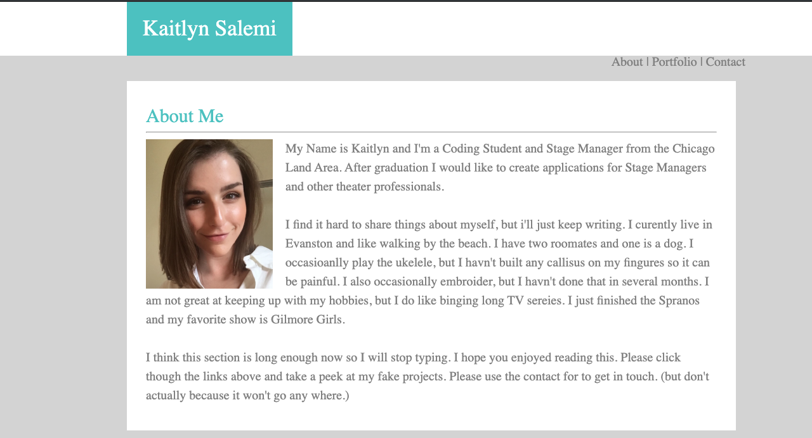

# Portfolio

## The Objective 

For the assignment, we were to make a website with three pages. We had to style them with css to resemble the images below.

## The Purpose 

The purpose of the exercise is to code with only a visual to guide you. In the future, we'll have to decide what the end product will be before we start any coding. 

## The Process

After all of the files were created I started on the html. For each page I started at the top with the heading and ended with the footer. Inbetween I added the information and images needed for the page. 

Next I added color so that each element was more easily seen. 

Then, I continued on with the formating. 

Eventually, I arrived at the final product. 

## Challenges 

The components I struggled with most were getting the click-thrus to float properly and formatting the Portfolio page.

